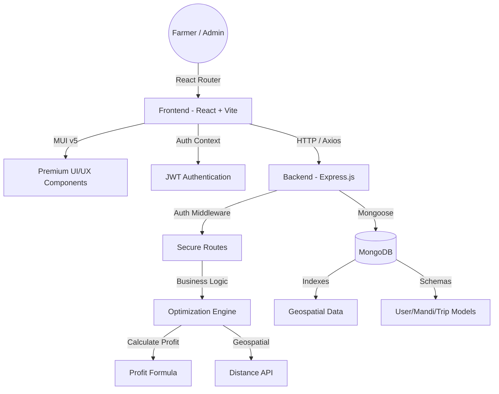

# Krishi-Route 🌾
### *Revolutionizing Agricultural Logistics through Smart Optimization*

[](https://opensource.org/licenses/MIT)
[](https://reactjs.org/)
[](https://nodejs.org/)
[](https://www.mongodb.com/)
[](https://mui.com/)

**Krishi-Route** is a premium, data-driven platform designed to eliminate the middleman and maximize farmer profits. By integrating real-time market data, geospatial analysis, and transport pooling, we empower rural communities to make smarter, more profitable decisions.

🔗 **[Live Demo Hosted on Vercel](https://code4-crops.vercel.app/)**
📺 **[Watch our Project Showcase](https://drive.google.com/drive/folders/1EmfPVGZyaL5DB-3kiu4QlOdJdbFpa2kX?usp=sharing)**

---

## 🔥 App Features (Module Breakdown)

### 1. 💰 Profit Maximization Engine
- **Dynamic Calculation**: Net Profit = (Market Price × Yield) - (Distance × Fuel Cost) - Handling Fees.
- **Optimal Mandi Selection**: Scans all regional Mandis to find the highest return-on-investment.
- **Yield Forecasting**: Basic logic to estimate total earnings based on crop variety.

### 2. 🚚 Rural Transport Pooling ("Uber for Crops")
- **Social Logistics**: Find other farmers heading to the same market on the same day.
- **Cost Sharing**: Automatically calculates shared transport overhead to reduce individual expenses by up to 40%.
- **Matchmaking**: View contact details and capacity of potential pooling partners.

### 3. 🗺️ Geospatial Intelligence
- **Interactive Mapping**: Powered by Leaflet.js with GPU-acceleration.
- **Distance Estimation**: Real-time distance calculations from farmer location to Mandi.
- **Visual Routes**: See exactly where your crops are going.

### 4. 📈 Smart Analytics Dashboard
- **Price Trends**: Historical data analysis to identify "Best Day to Sell".
- **Market Pressure**: Real-time arrival monitoring to avoid "Price Drops" due to oversupply.
- **Demand Radar**: Visualizing which crops are most wanted in specific regions.

### 5. 🌍 Universal Accessibility (13+ Languages)
- **Deep Localization**: English, Hindi, Tamil, Telugu, Malayalam, Kannada, Marathi, Gujarati, Bengali, Urdu, Odia, Assamese, Punjabi.
- **RTL Support**: Full support for Urdu and other Right-to-Left scripts.

---

## �️ Detailed Architecture

The system follows a classic **MERN (MongoDB, Express, React, Node)** stack with a focus on modularity and high-performance UI.



---

## 🛡️ Complete Test Account Directory

> [!IMPORTANT]
> **SMTP NOTICE**: Due to a temporary issue with our mail relay (Brevo), OTP verification is bypassed/disabled in the hosted version for test IDs. **Please use the following pre-verified accounts:**

### 👨‍🌾 Farmer Test Accounts (Password: `123456`)
| Location | Email ID | Role |
| :--- | :--- | :--- |
| North Region | `farmer1@krishiroute.com` | Standard Farmer |
| South Region | `farmer2@krishiroute.com` | Standard Farmer |
| East Region | `farmer3@krishiroute.com` | Standard Farmer |
| West Region | `farmer4@krishiroute.com` | Standard Farmer |
| *Batch* | `farmer5@krishiroute.com` to `10` | Standard Farmers |

### 🏪 Mandi Operator Accounts (Password: `123456`)
| Region (State Code) | Email ID | Coverage |
| :--- | :--- | :--- |
| **TN** (Tamil Nadu) | `mandi_tn1@krishiroute.com` | Regional Market Admin |
| **PB** (Punjab) | `mandi_pb1@krishiroute.com` | Regional Market Admin |
| **MH** (Maharashtra) | `mandi_mh1@krishiroute.com` | Regional Market Admin |
| **KL** (Kerala) | `mandi_kl1@krishiroute.com` | Regional Market Admin |
| **AP** (Andhra Pradesh) | `mandi_ap1@krishiroute.com` | Regional Market Admin |
| *Global* | `mandi_[state_code]1@...` | Works for all 28 states! |

---

## � Detailed Run Plan (Local Setup)

### 1️⃣ Prepare Environment
Clone the repository and ensure you have **Node.js (v18+)** and **MongoDB** installed.

### 2️⃣ Configure Secrets
You **MUST** create these files for the system to boot correctly.

#### 📂 Backend (`backend/.env`)
```env
PORT=5000
MONGODB_URI=mongodb://localhost:27017/krishiroute
JWT_SECRET=hackathon_secret_2024
SMTP_HOST=smtp.gmail.com
SMTP_PORT=587
SMTP_USER=test@gmail.com
SMTP_PASS=app_password_here
```

#### 📂 Frontend (`frontend/.env`)
```env
VITE_API_URL=http://localhost:5000/api
```

### 3️⃣ Launch Procedure

#### 🖥️ Scenario A: Automated One-Click (Recommended)
Our custom scripts handle dependency installation, data seeding, and server synchronization automatically.
- **Windows**: Run `.\start.bat` as Administrator.
- **Linux/bash**: Run `chmod +x start.bash && ./start.bash`.

#### �️ Scenario B: Manual Micro-Management
**Terminal 1 (Backend):**
```bash
cd backend
npm install
npm run dev
```

**Terminal 2 (Frontend):**
```bash
cd frontend
npm install
npm run dev
```

---

*Built with ❤️ for a more profitable farming future.*
